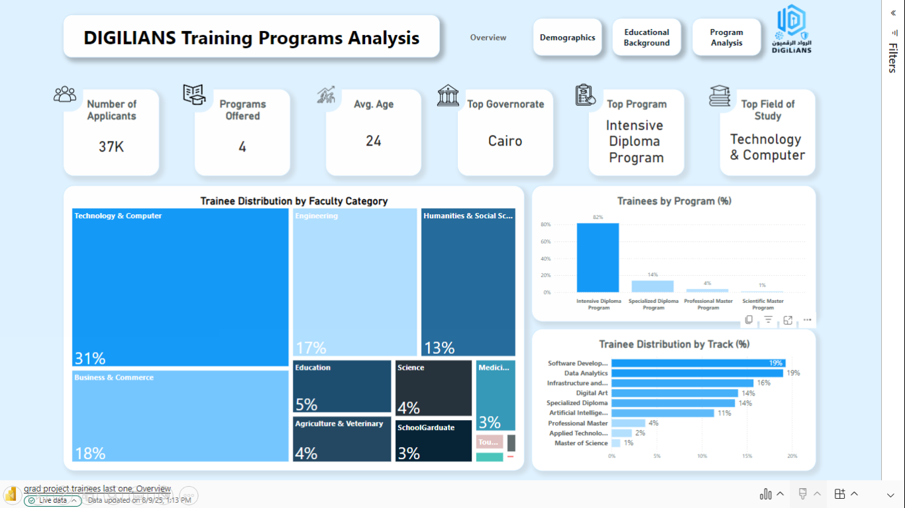

# Egypt Digital Skills Training Analysis

## 📌 Project Overview
This project analyzes data from 37,000+ applicants to the Ministry of Communications and Information Technology's national digital skills training programs in Egypt. The goal was to assess program reach, understand applicant profiles, and identify underserved regions to improve targeting and program design.

## 🎯 Business Case
The Ministry needed actionable insights to evaluate program reach, applicant relevance, and demand trends. With a large and diverse applicant base, it was critical to clean, standardize, and visualize the data for evidence-based decision-making.

## 🧹 Data Cleaning (Python)
Data cleaning was performed in Python before loading into Power BI:
- Removed irrelevant records and dummy entries (e.g., “aaa”, “test”)
- Dropped unnecessary personal and redundant columns
- Standardized missing values for graduation year, academic year, grade, university, and faculty
- Grouped faculties into broader categories for meaningful analysis
- Calculated Age from Date of Birth
- Derived LinkedIn Status from the presence of a valid profile URL

📄 See the full [Data Cleaning Notebook](notebooks/01_data_cleaning.ipynb) for details.

## 📊 Data Visualization (Power BI)
After cleaning, the dataset was imported into Power BI to create interactive dashboards:
- **Applicant Demographics**: Gender, age distribution, academic background
- **Geographic Spread**: Applicant counts by governorate
- **Program Demand**: Popular tracks and program selections
- **Gaps & Inequities**: Underrepresented regions and groups

These dashboards help stakeholders:
- Identify where outreach should be expanded
- Tailor programs to better match applicant profiles
- Monitor demand trends over time

🖼 **Dashboard Preview:**

## 🛠 Tools & Technologies
- **Python**: Data cleaning & preprocessing (Pandas, NumPy)
- **Power BI**: Data modeling, visualization, and reporting
- **Excel**: Initial data review
- **DAX**: Calculated measures in Power BI

## 📂 Repository Structure
├── notebooks/ # Jupyter notebooks for data cleaning
│ └── 01_data_cleaning.ipynb
├── images/ # Screenshots of the dashboard
│ └── dashboard-preview.png
├── Digilians_Egypt_Analysis.pbix # Power BI file
└── README.md # Project documentation
